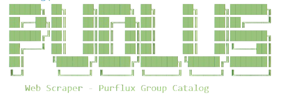

# Purflux Catalog Scraper



## 📌 Overview

The **Purflux Catalog Scraper** is a Node.js application that automates the extraction of product data from the Purflux Group Catalog website. Using Puppeteer, the scraper navigates through the catalog, retrieves product references, and scrapes detailed product information such as dimensions, images, OE\_PN values, and vehicle applications.

## 🚀 Features

- Scrapes product references from the main catalog.
- Extracts detailed product information including IAM\_PN, dimensions, images, and OE\_PN values.
- Saves extracted data into structured JSON files.
- Automatically generates a timestamped folder for each scraping session.

---

## 📥 Installation

### Prerequisites

Ensure you have the following installed on your system:

- **Node.js** (Latest LTS version recommended)
- **npm** (Node Package Manager, comes with Node.js)

### Steps

1. Clone this repository:
   ```sh
   git clone https://github.com/SimJiaYang/purflux-scraper.git
   cd purflux-catalog
   ```
2. Install dependencies:
   ```sh
   npm install
   ```

---

## ▶️ How to Run

To start the scraper, simply run:

```sh
npm start
```

This will execute `scraper.js`, which:

1. Extracts product references from the main catalog.
2. Scrapes detailed product data for each reference.
3. Saves the extracted data as JSON files in a timestamped directory inside the `product` folder.

---

## 🔍 Approach

1. **Scrape Main Catalog:**
   - Navigate to the catalog page.
   - Click on the **Reference** tab.
   - Extract product references from the dropdown.
   - Save extracted references to a JSON file.
2. **Scrape Product Details:**
   - Construct the product detail URL using the extracted references.
   - Extract IAM\_PN, product line, dimensions, image URLs, OE\_PN values, and vehicle application data.
   - Save the data in a structured JSON format.
3. **Automated Execution:**
   - The scraper runs through each product reference sequentially.
   - A short delay is introduced to prevent website blocking.

---

## 🛠 Dependencies

- [**Puppeteer**](https://www.npmjs.com/package/puppeteer) - Headless browser automation.
- [**Axios**](https://www.npmjs.com/package/axios) - For potential HTTP requests.
- **fs (Node.js built-in module)** - File system operations.
- **path (Node.js built-in module)** - Path utilities.

---

## 📁 Output Structure

```
product/
 ├── 12032024_1530/             # Timestamped folder
 │   ├── product_references.json  # List of scraped product references
 │   ├── product_A1259.json       # Detailed data of a specific product
 │   ├── product_B4567.json       # Detailed data of another product
 │   └── ...                      # More scraped products
```

---

## 📌 Overview of the Approach  

The scraper follows a structured process to efficiently extract product data from the **Purflux Group Catalog** website:  

### 1️⃣ Navigate to the Catalog Homepage  
- Visits the base URL and waits until the page is fully loaded.  

### 2️⃣ Extract Product References  
- Clicks the **"Reference"** tab to access the product reference list.  
- Retrieves all available references and stores them in a JSON file.  

### 3️⃣ Scrape Product Details  
For each product reference, the scraper navigates to its detail page and extracts key information:  
- ✅ **IAM_PN** (Product Number)  
- ✅ **Product Line**  
- ✅ **Dimensions** (Height, Length, Width)  
- ✅ **OE_PN Values** (Original Equipment Part Numbers)  
- ✅ **Vehicle Applications**  
- ✅ **Product Image URL**  

### 4️⃣ Save Data  
- The extracted data is saved in **JSON format** inside a uniquely named directory based on the **current timestamp**.  

---

## 🎯 Overview of Design Decisions and Assumptions  

### **📌 Design Decisions**  

✔ **Use of Puppeteer**  
- Puppeteer automates browser interactions, allowing extraction of dynamic content that isn't available via direct HTTP requests.  

✔ **Headless Mode Enabled**  
- Runs in **headless mode (`headless: "new"`)** for faster execution while maintaining full page access.  

✔ **Data Storage in JSON Format**  
- Chosen for its simplicity, easy parsing, and compatibility with databases or other applications.  

✔ **Timestamped Output Directory**  
- Each scraping session stores results in a **separate directory** to prevent data overwrites and support historical analysis.  

✔ **Sequential Scraping with Delays**  
- Introduces **small delays (`setTimeout`)** between requests to reduce the risk of being blocked.  

✔ **Error Handling**  
- Implements `try-catch` blocks and logs errors to handle:  
  - **Network failures**  
  - **Missing elements**  
  - **Unexpected website changes**  

---

### **🔍 Assumptions**  

🔹 **Website Structure Remains Stable**  
- The scraper relies on specific CSS selectors, assuming the website’s layout remains unchanged.  

🔹 **Product References Are Available**  
- Expects a **populated** list of product references under the **'Reference'** tab.  

🔹 **All Required Data Exists on the Product Page**  
- If any field is missing, it defaults to `"N/A"` instead of causing failures.  

🔹 **Scraping is Allowed**  
- No strict anti-scraping mechanisms (e.g., CAPTCHA or bot detection) are currently enforced.  

---

## 🤝 Contributions

Feel free to submit issues or pull requests if you want to improve the scraper.

---

## 📜 License

This project is licensed under the **MIT License**.

